# webhacking.kr(old) write-ups 
<br>

## old-01

__쿠키 인젝션__

```php
<?php  
    if(!is_numeric($_COOKIE['user_lv'])) $_COOKIE['user_lv']=1;  
    if($_COOKIE['user_lv']>=6) $_COOKIE['user_lv']=1;  
    if($_COOKIE['user_lv']>5) solve(1);  
    echo "<br>level : {$_COOKIE['user_lv']}";  
?>  
```

쿠키 user_lv의 값을 조건에 맞게 바꿔야 한다.
쿠키는 5 초과 6 미만인 값이어야 하므로, 그 사이의 값(ex 5.5)을 넣으면 성공.  

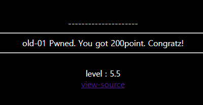  
<br>
  
## old-02**

__블라인드 SQL 인젝션__  

`<!-- if you access admin.php i will kick your ass -->` 따라 들어가보자.  

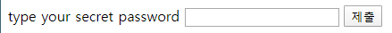  

input 필드가 나온다. admin에 접근하려면 password를 알아내야 한다.  
페이지의 소스코드 주석의 시간과 time 쿠키를 단서로 하여  쿠키의 값을 몇 번 고쳐보니,
쿠키에 넣은 논리값이 거짓일 때는 `2070-01-01 09:00:00`로, 참일 때는  `2070-01-01 09:00:01`로 바뀐다.

<br>

## old-03

__SQL 인젝션__

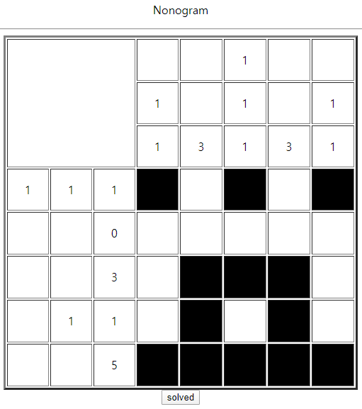  

..? 노노그램? 답을 입력하니 다음과 같은 input 필드가 나온다. 


소스코드를 확인해보니 answer에 들어가는 hidden 필드가 있다.  
`<form method=post action=index.php><input type=hidden name=answer value=1010100000011100101011111>`   
여기에 '를 넣어보니 쿼리 에러가 발생해 SQL 인젝션으로 값이 항상 참이 되게 하면 성공.

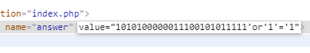

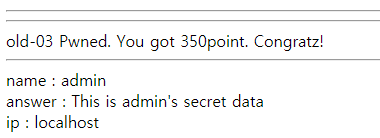

<br>

## old-04

__레인보우테이블__

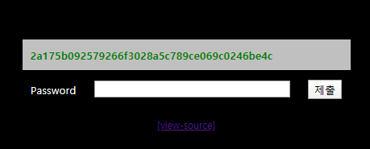

해시 값을 디코딩해서 패스워드 값을 찾는 것 같다.

```php+HTML
<?php
	sleep(1); // anti brute force
	if((isset($_SESSION['chall4'])) && ($_POST['key'] == $_SESSION['chall4'])) solve(4);
	$hash = rand(10000000,99999999)."salt_for_you";
	$_SESSION['chall4'] = $hash;
	for($i=0;$i<500;$i++) $hash = sha1($hash);
?>
...
<tr><td colspan=3 style=background:silver;color:green;><b><?=$hash?></b></td></tr>
```

세션값은 10000000~99999999사이의 임의의 값 + salt_for_you, 출력된 값은  이를 500번 sha1 인코딩 한 값이다.  
그러나 sha1은 단방향 암호화 알고리즘으로 500번이나 디코딩할 수 없다.  
브루트 포스 공격도 불가능하므로 파이썬으로 레인보우 테이블을 만들어주면 될듯하다.

__exploit__: [old-04.py](./code/old-04.py)

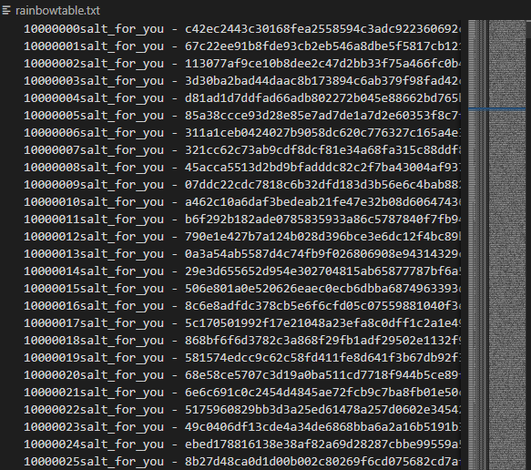

(ㅎㄷㄷ)

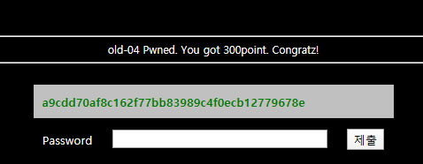

<br>

## old-05

__SQL 절단 공격__

login으로 들어가면 다음과 같이 mem 디렉터리가 노출되며 디렉터리 인덱싱이 가능하다.


/mem으로 접속하면 접속이 거부되었던 join.php에 접근할 수 있게 된다.

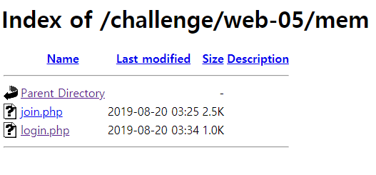

join.php의 소스코드를 보면 암호화가 되있다.
```javascript
<script>
l='a';ll='b';lll='c';llll='d';lllll='e';llllll='f';lllllll='g';llllllll='h';lllllllll='i';llllllllll='j';lllllllllll='k';llllllllllll='l';lllllllllllll='m';llllllllllllll='n';lllllllllllllll='o';llllllllllllllll='p';lllllllllllllllll='q';llllllllllllllllll='r';lllllllllllllllllll='s';llllllllllllllllllll='t';lllllllllllllllllllll='u';llllllllllllllllllllll='v';lllllllllllllllllllllll='w';llllllllllllllllllllllll='x';lllllllllllllllllllllllll='y';llllllllllllllllllllllllll='z';I='1';II='2';III='3';IIII='4';IIIII='5';IIIIII='6';IIIIIII='7';IIIIIIII='8';IIIIIIIII='9';IIIIIIIIII='0';li='.';ii='<';iii='>';lIllIllIllIllIllIllIllIllIllIl=lllllllllllllll+llllllllllll+llll+llllllllllllllllllllllllll+lllllllllllllll+lllllllllllll+ll+lllllllll+lllll;
lIIIIIIIIIIIIIIIIIIl=llll+lllllllllllllll+lll+lllllllllllllllllllll+lllllllllllll+lllll+llllllllllllll+llllllllllllllllllll+li+lll+lllllllllllllll+lllllllllllllll+lllllllllll+lllllllll+lllll;if(eval(lIIIIIIIIIIIIIIIIIIl).indexOf(lIllIllIllIllIllIllIllIllIllIl)==-1) {alert('bye');throw "stop";}if(eval(llll+lllllllllllllll+lll+lllllllllllllllllllll+lllllllllllll+lllll+llllllllllllll+llllllllllllllllllll+li+'U'+'R'+'L').indexOf(lllllllllllll+lllllllllllllll+llll+lllll+'='+I)==-1){alert('access_denied');throw "stop";}else{document.write('<font size=2 color=white>Join</font><p>');document.write('.<p>.<p>.<p>.<p>.<p>');document.write('<form method=post action='+llllllllll+lllllllllllllll+lllllllll+llllllllllllll+li+llllllllllllllll+llllllll+llllllllllllllll
+'>');document.write('<table border=1><tr><td><font color=gray>id</font></td><td><input type=text name='+lllllllll+llll+' maxlength=20></td></tr>');document.write('<tr><td><font color=gray>pass</font></td><td><input type=text name='+llllllllllllllll+lllllllllllllllllllllll+'></td></tr>');document.write('<tr align=center><td colspan=2><input type=submit></td></tr></form></table>');}
</script>
```

코드를 조금예쁘게 정리해 보자. https://beautifier.io/  
js beautifulier와 console 이용해서 해석해보면 다음과 같다.
```javascript
<script>
    if (document.cookie.indexOf(oldzombie) == -1) {
        alert('bye');
        throw "stop";
    }
    if (document.URL.indexOf(mode=1) == -1) {
        alert('access_denied');
        throw "stop";
    } else {
...
</script>
```
oldzombie 쿠키가 있어야 하며 url에 mode=1이 있어야 한다는 조건을 맞춰주니 회원가입하는 창이 나타났다.

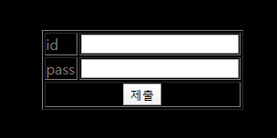

admin으로 로그인해야 하는데 이는 이미 있는 id라고 나온다. max length를 20보다 크게 바꿔줘 아무 문자나 입력하면 이후 문자열을 자르고 admin만 받아들인다.

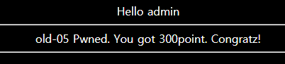

## old-06

### base64

소스코드를 요약하면,20번 base64 인코딩하고 규칙대로 replace한 값인 user 쿠키와 password 쿠키의 값을 거꾸로 replace하고 20번 base64 디코딩한 값이 각각 admin, nimda와 같으면 풀린다.   
쿠키에 들어갈 값을 만들어보자.  

__exploit__: [old-06.py](./code/old-06.py)

변환한 값을 쿠키에 넣어주면 성공.  
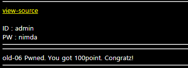

<br>

## old-07

### SQL 인젝션

```php
<?php
$go=$_GET['val'];
...
$db = dbconnect();
$rand=rand(1,5);
if($rand==1){
  $result=mysqli_query($db,"select lv from chall7 where lv=($go)") or die("nice try!");
}
...
$data=mysqli_fetch_array($result);
if(!$data[0]) { echo("query error"); exit(); }
if($data[0]==1){
  echo("<input type=button style=border:0;bgcolor='gray' value='auth' onclick=\"alert('Access_Denied!')\"><p>");
}
elseif($data[0]==2){
  echo("<input type=button style=border:0;bgcolor='gray' value='auth' onclick=\"alert('Hello admin')\"><p>");
  solve(7);
}
?>
```

소스코드를 확인해보면 GET방식으로 받은 값을 정규표현식을 통해 필터링을 거쳐 5분의 1확률로 성공하는 SQL 쿼리문에 넣는 것 같다.  
마지막 부분을 보면 $data[0]을 2로 만들어야 문제가 해결되므로 UNION을 이용해 앞의 쿼리문을 거짓으로 만들고 뒤의 쿼리문을 참으로 만들어야 한다.  

따라서 `val=0)UNION SELECT 2` 와 같이 쓰고 싶은데.. 다음 정규표현식이 이를 필터링해 두가지 문제점이 있다.  
`if(preg_match("/2|-|\+|from|_|=|\\s|\*|\//i",$go)) exit("Access Denied!");`

1. 띄어쓰기가 안된다. 정규표현식이 공백(\s)을 막고 있으므로 괄호를 사용해야 할듯하다.
2. 2를 사용하지 못한다. 정규표현식이 사칙연산과 2를 막고 있으므로 2를 직접적으로 입력하지 못한다. 따라서 char(50)등의 방법으로 우회해봐야 할듯하다.
   
결국 `val=0)UNION(SELECT(CHAR(50))` 과 같이 작성해서 5번정도 새로고침했더니 성공.

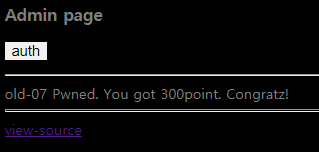