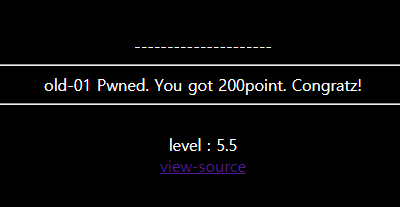
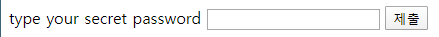
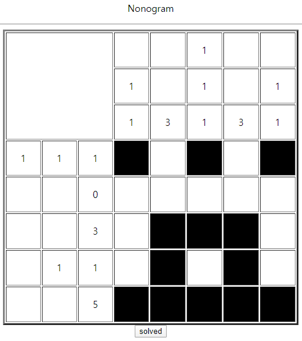
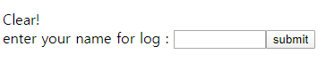

# webhacking.kr(old) write-ups

## old-01

쿠키 인젝션  

```php
  <?php  
    if(!is_numeric($_COOKIE['user_lv'])) $_COOKIE['user_lv']=1;  
    if($_COOKIE['user_lv']>=6) $_COOKIE['user_lv']=1;  
    if($_COOKIE['user_lv']>5) solve(1);  
    echo "<br>level : {$_COOKIE['user_lv']}";  
  ?>  
```

쿠키 user_lv의 값을 조건에 맞게 바꿔야 한다.  
쿠키는 5 초과 6 미만인 값이어야 하므로, 그 사이의 값(ex 5.5)을 넣으면 성공.  

  

## old-02**

블라인드 SQL 인젝션

`<!-- if you access admin.php i will kick your ass -->` 따라 들어가보자.  

  
input 필드가 나온다. admin에 접근하려면 password를 알아내야 한다.  
페이지의 소스코드 주석의 시간과 time 쿠키를 단서로 하여  쿠키의 값을 몇 번 고쳐보니,  
쿠키의 값이 거짓일 때는 현재 시간이, 참일 때는  `2070-01-01 09:00:01` 시간으로 바뀜을 알 수 있다.  


## old-03

SQL 인젝션


..? 노노그램? 답을 입력하니 다음과 같은 input 필드가 나온다.


소스코드를 확인해보니 `<form method=post action=index.php><input type=hidden name=answer value=1010100000011100101011111>` hidden 필드가 있다.  
여기에 '를 넣어보니 쿼리 에러가 발생해 SQL 인젝션을 시도해 보았다.  
